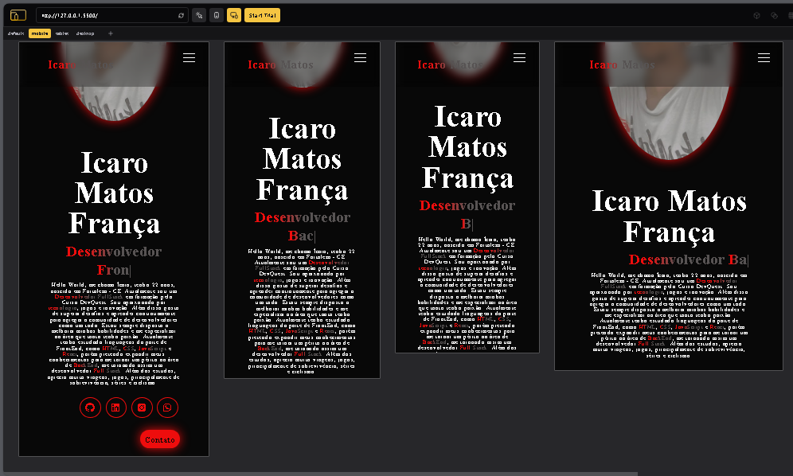
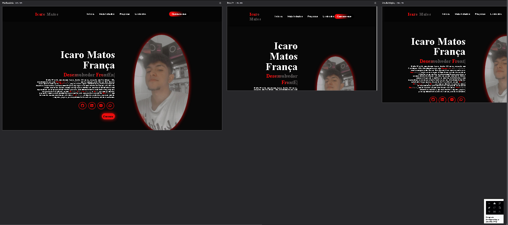

💻 Portfólio Pessoal

💡 Descrição -------------------------------------------------------------------------------------------------------------

Este projeto foi desenvolvido com HTML, CSS e JavaScript.

HTML: Foi usado a linguagem de marcação de texto HTML para organização de seções do site, estrutura básica e semântica. Usei tags como <header> <footer> para seções de cabeçalho e rodapé, além de usar a tag <i> para tags de alguns ícones de redes sociais. Acrescentei também, classes únicas e *ID's* que redireciona usuários até a seção desejada. Para, posteriormente estilizar no CSS.

Estilização do CSS: A estilização com CSS foi para criar um layout amplamente atrativo e responsivo em quaisquer aparelhos eletrônicos, usei cores como #ee0d0d, #ffffff, #575353 e variações de #000000, poucas cores, com 
intuito de ficar o mais intuitivo possível.

Na seção de Habilidades utilizei border radius e box shadow para que o visual parecesse o mais semelhante possível a um card. Também apliquei um width e height para que o conteúdo não vazasse do card, alinhei os elementos com o Display *FLEX* e apliquei um hover que emprega um efeito após o usuário passar seu mouse em cima, mudando assim a cor da fonte, juntamente com uma animação de transição.

Meu portfólio em grande parte foi estilizado com propriedades oferecidas pelo display *FLEX* para alinhamento central dos itens em telas de pequeno, médio e grande porte. A seção de Projetos foi a única que usei o display *GRID*, onde criei 2 colunas para que os vídeos ficassem em pares. Apliquei display none na *DIV* de informações dos cards e usei position relative e absolute para que o conteúdo apenas aparecesse quando o usuário deslocasse o mouse por cima dos cards de projetos.
P.S: O conteúdo do cartão é atrelado a um link que leva para o site em que o projeto está hospedado.

Nas seções de Contato e Footer (Rodapé), novamente usei o Display *FLEX* para organização dos elementos. No Footer usei o mesmo parâmetro do Header (Cabeçalho), utilizando uma *ul* com 4 *li* que levariam diretamente para seções do portfólio em que foi clicado. 

JavaScript: Por fim no JavaScript, apliquei apenas um TypeWriter que fica localizado na parte do Ínicio onde contém informações sobre mim. 
Também foi introduzido o EmailJs, um site com templates que me permite receber emails na caixa de entrada de pessoas que queiram entrar em contato comigo.

Responsividade: Na responsividade foram criadas 3 *media queries*, para que o conteúdo pudesse adaptar sem prejudicar a experiência do usuário, a interface se adequa a múltiplas telas, seja de celulares, tablets ou desktops de telas maiores.

🧑‍🎓 Curso DevQuest -----------------------------------------------------------------------------------------------------

Acredito fortemente que o curso DevQuest foi um divisor de águas para que eu pudesse desenvolver esse projeto, nunca passou pela minha cabeça de criar um Portfólio profissional para que eu pudesse demonstrar meus conhecimentos e habilidades. É onde eu me mantenho em constante evolução e me aprimorando para melhorar como um desenvolvedor FrontEnd e posteriormente me tornar um FullStack.

📎Referências ---------------------------------------------------------------------------------------------------------

Usei algumas pessoas como referências e vou deixar aqui para quem quiser seguir exemplos, acrescentei algumas ideias vendo seus projetos e estilizei da minha maneira.

👦 Wesley Oliveira

📎 GitHub: https://github.com/wesleysword
📎 Linkedin: https://www.linkedin.com/in/wesley-oliveira-santos/
📎 Portfólio: https://wesleysword.github.io/portfolio/

👧 Amanda Di Lorenzo

📎 GitHub: https://github.com/mandiilorenzo
📎 Linkedin: https://www.linkedin.com/in/mandilorenzo/
📎 Portfólio: https://mandiilorenzo.github.io/portfolio-amanda/#

👦 Walassi

📎 GitHub: https://github.com/walassisilva
📎 Linkedin: https://www.linkedin.com/in/walassi-silva/
📎 Portfólio: https://walassi-silva-portfolio.vercel.app/
 
📞 Entre em contato comigo ---------------------------------------------------------------------------------------------

Email: icaromatoss@hotmail.com
Linkedin: https://www.linkedin.com/in/devicaromatoss/

😎 Conclusão ------------------------------------------------------------------------------------------------------------

Esse foi um projeto desafiador, onde tive que por em prática, conceitos de flex, alinhamento de itens em containers, divisão de seções e responsividade. Também tentei deixar o código o mais limpo possível para que ele pudesse ser compreendido por todos que o acessem, independente do grau de aprendizado. Foi onde aprendi também técnicas como TypeWriter e conexão de formulários com Email, além de aprender mais sobre o Menu Hamburguér e sobre responsividade para outros dispositivos.